# OCPPcharger

Android charging station UI and OCPP client for the demo EV charger flow.

This app connects to `ocppCSMS` over WebSocket using OCPP-J frames. The charger identity is carried in the WebSocket path, for example:

```text
ws://10.0.2.2:8080/CSMSWebsocketServer-1/CS01
```

`10.0.2.2` is the Android emulator address for the host machine. On a real Android/Raspberry Pi device, replace it with the CSMS machine IP address.

## What The App Does

The app behaves like a simple OCPP charging station:

1. Starts the WebSocket connection to the CSMS.
2. Sends `BootNotification`.
3. Waits for `BootNotificationResponse` with `Accepted`.
4. Shows the product charging screen.
5. Lets the EV driver authorize with RFID or PIN fallback.
6. Sends `Authorize`.
7. Sends cable and connector state through `StatusNotification` and `TransactionEvent`.
8. Starts charging and shows live meter/battery/cost data.
9. Sends periodic charging updates through `TransactionEvent` with `meterValue`.
10. Handles EV-side unplug suspension, driver-authorized stop, billing payment display, and target-SOC completion.

## Product Branch UI

The `product` branch keeps the driver-facing UI to two appliance-style screens: a boot/OCPP connection screen and the product charging screen. Both place the station LED rail beside the display, like a real charger front panel.

The product hardware shape is:

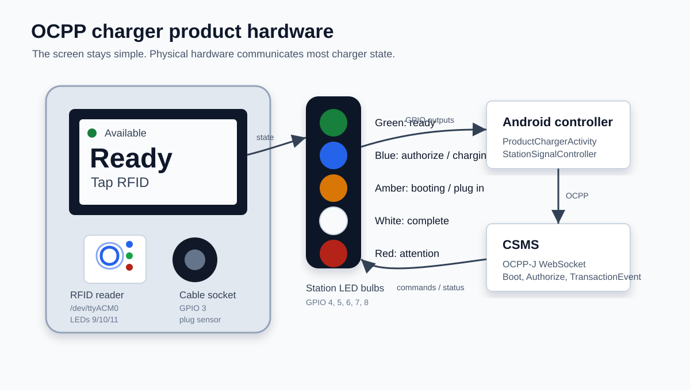

Hardware state gallery:

| State | Hardware view |
| --- | --- |
| Booting | 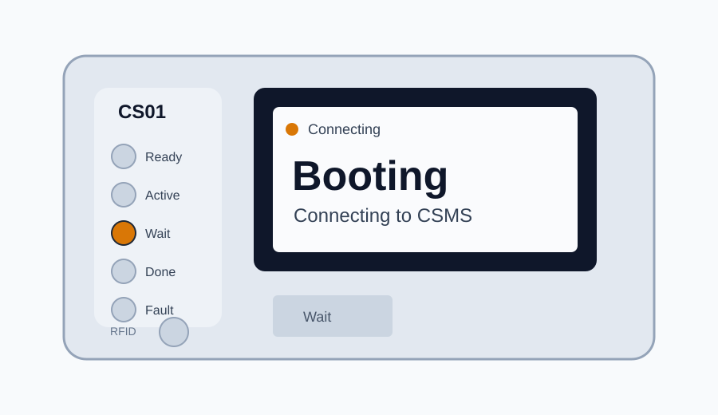 |
| Ready | 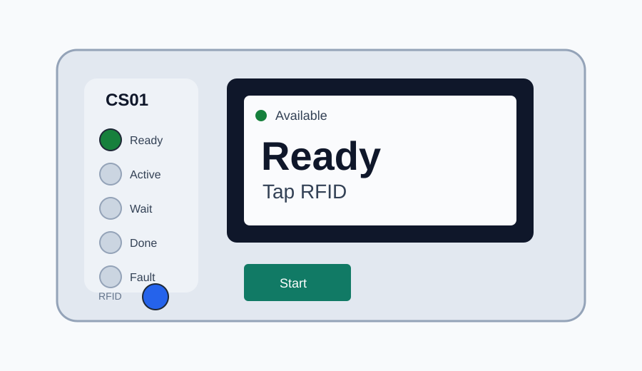 |
| Authorize | 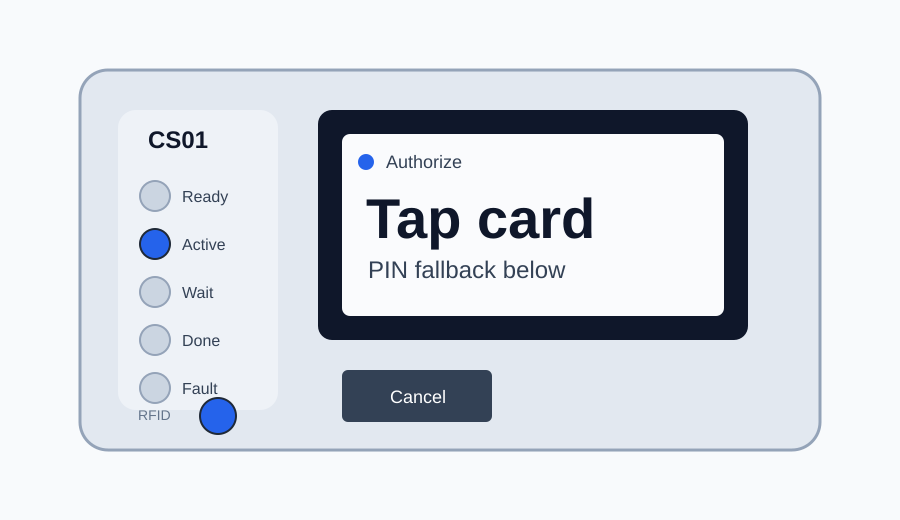 |
| Plug in | 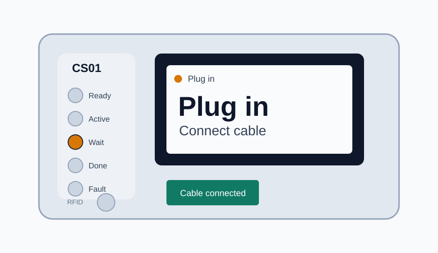 |
| Charging | 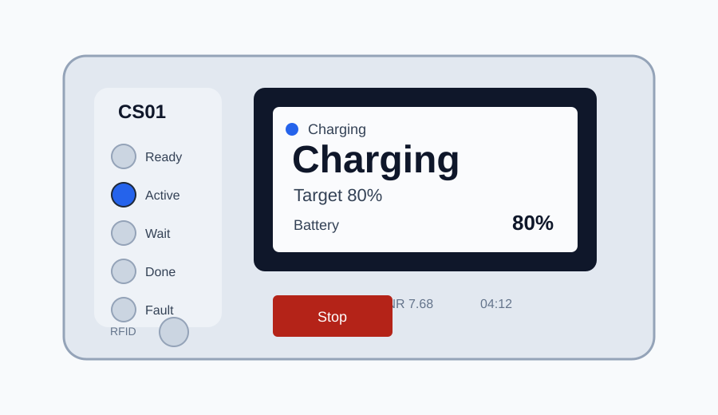 |
| Billing | 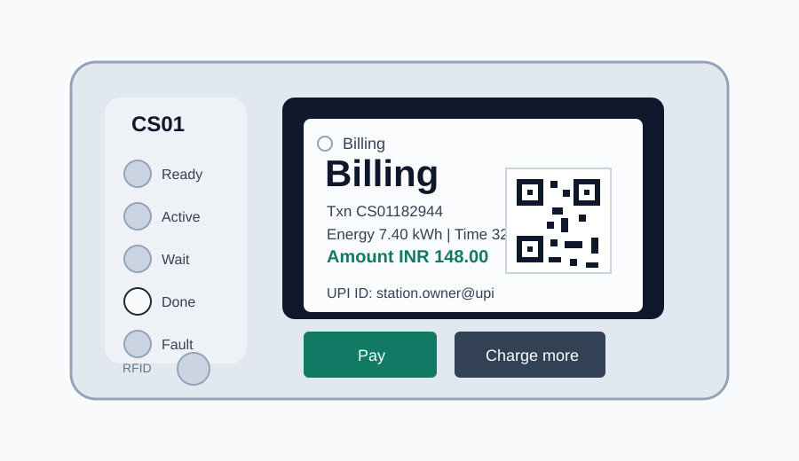 |
| Attention | 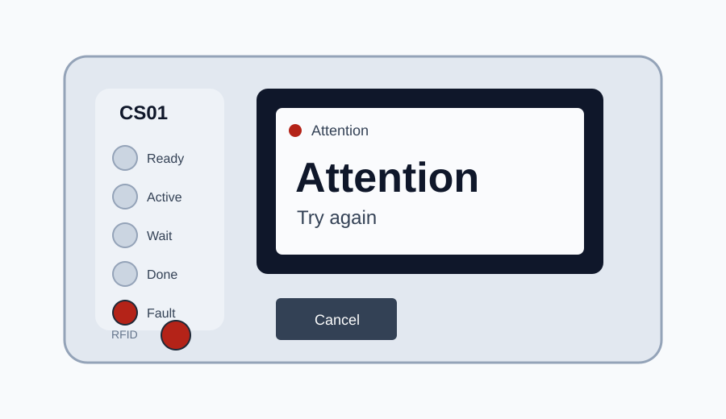 |

The active screen is intentionally minimal:

- The boot screen only shows connection state, the station LED rail, and a compact CSMS log.
- Big state text, for example `Ready`, `Tap card`, `Plug in`, `Charging`, or `Billing`.
- One primary action button.
- PIN input only when RFID fallback is needed.
- A single battery artwork indicator from `app/src/main/drawing*-playstore.png` during active charging, with energy/cost/time kept as small secondary text.
- While charging is active, the bill is only shown after a successful stop.
- After a successful stop, `Billing` directly shows transaction id, energy, duration, amount, a scannable UPI QR, and the owner UPI ID.
- The demo owner UPI ID is `station.owner@upi`. Replace it with the station owner's real VPA before using the payment QR outside a demo.
- `Pay` opens the same `upi://pay` payload on the station device when a UPI app is installed; normally the driver scans the on-screen QR from their phone.
- Physical LED bulbs carry availability, authorization, plug-in, charging, finished-session, and fault state.
- The RFID scanner has its own LED feedback below/near the screen.

Battery artwork used by the Android UI:

<p>
  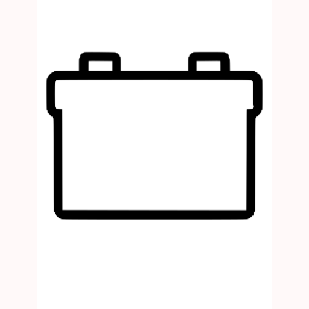
  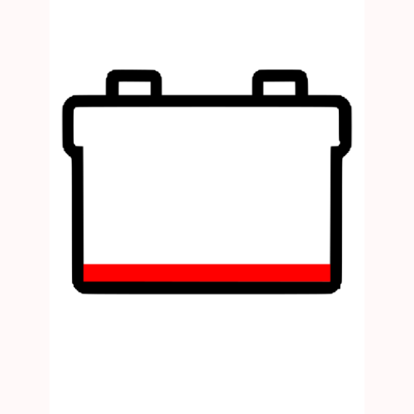
  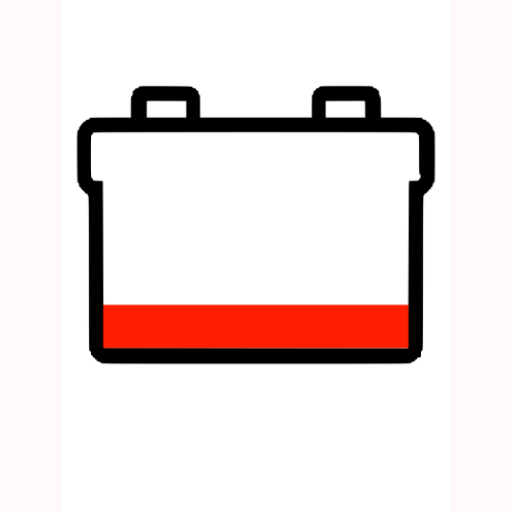
  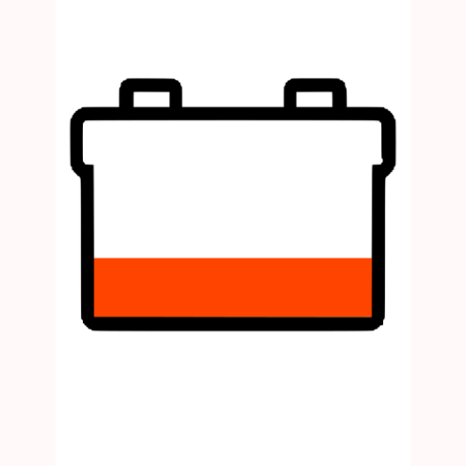
  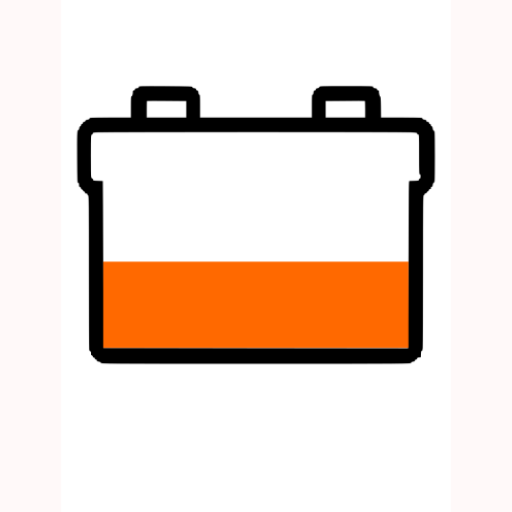
  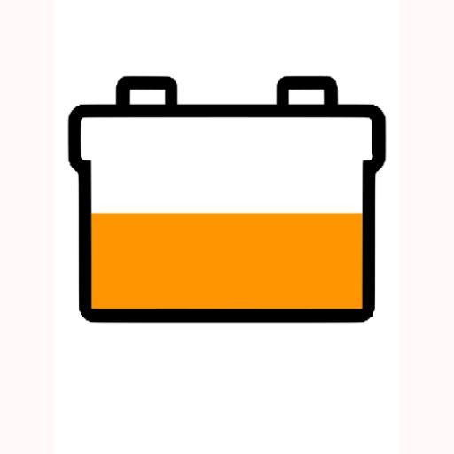
  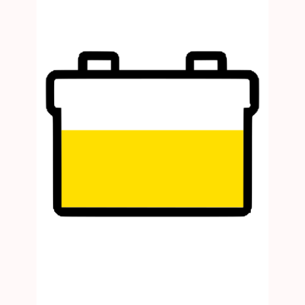
  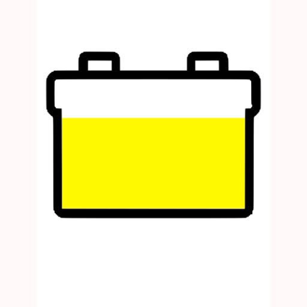
  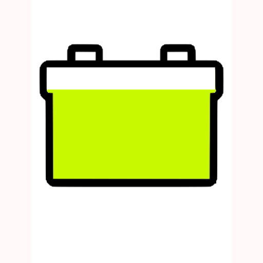
  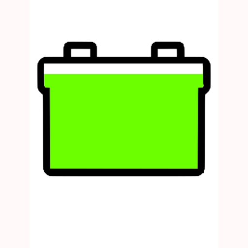
  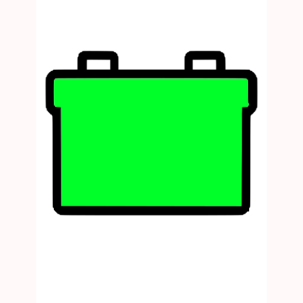
</p>

All product states:

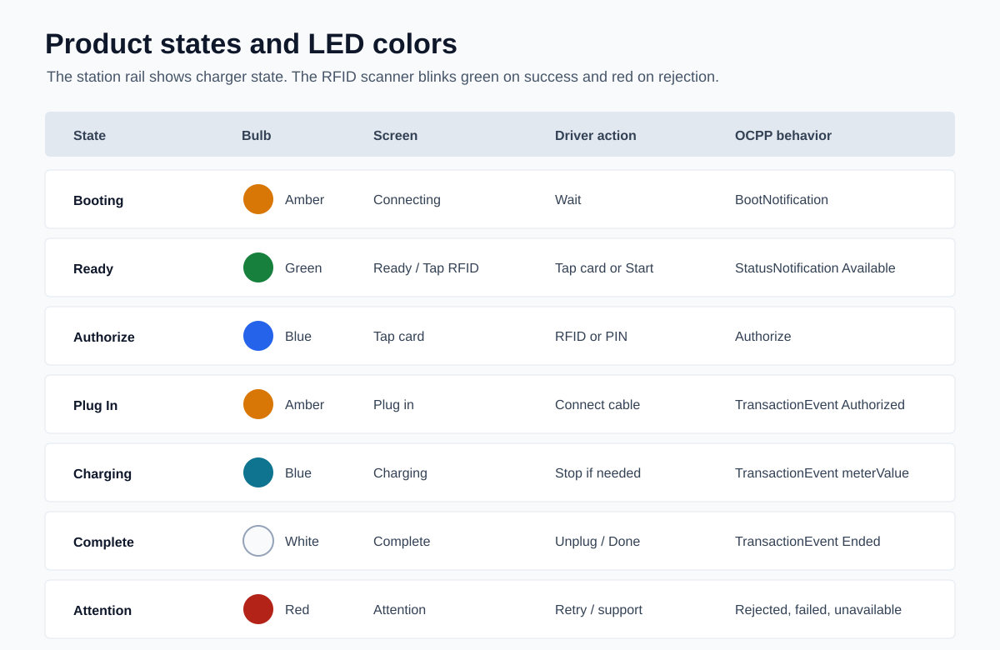

| Light | Meaning |
| --- | --- |
| Amber | Booting or waiting for cable connection. |
| Green | Connector available. |
| Blue | Waiting for authorization or actively charging. |
| White | Session finished; Billing screen is active. |
| Red | Authorization denied or station attention needed. |

`StationSignalController` maps these states to GPIO bulbs inspired by the `RHA` project. The default assumed pins are:

| Color | GPIO |
| --- | --- |
| Green | 4 |
| Blue | 5 |
| Amber | 6 |
| Red | 7 |
| White | 8 |

RFID scanner LEDs are separate from station status LEDs:

| Scanner LED | GPIO | Behavior |
| --- | --- | --- |
| Blue | 9 | Scanner ready / reading. |
| Green | 10 | Blink when authorization succeeds. |
| Red | 11 | Blink when authorization fails. |

The product screen mirrors the LEDs for emulator/demo use, but the intended product behavior is that drivers mostly follow the physical light and one primary action on the display.

Product flow:

1. `MainActivity` connects to CSMS and sends `BootNotification`.
2. On `Accepted`, the app opens `ProductChargerActivity`.
3. Green station light: driver can tap RFID or press Start.
4. Blue station light and blue scanner light: charger waits for RFID; PIN is a fallback.
5. Scanner green blinks on accepted authorization; scanner red blinks on rejected authorization.
6. Amber station light: driver plugs in the cable.
7. Blue station light: charging session runs, meter values come from the controller/Bluetooth path, and `CostUpdated` from CSMS refreshes the amount shown on screen.
8. If a permanently attached cable is unplugged at the EV side, charging is suspended. If it is not reconnected before `EVConnectionTimeOut`, the transaction ends and connector status returns to `Available`.
9. To stop charging manually, the driver must present the same IdToken used to start the session.
10. White station light: session finished; `Billing` shows the bill, UPI QR/UPI ID, and `Charge more` resets to Ready.

Charging and payment UI states:

| UI State | Driver Action | OCPP / Product Behavior |
| --- | --- | --- |
| Charging | Watch live battery/energy/cost/time. | Meter values are fed to the screen from the controller path; CSMS can update cost via `CostUpdated`. |
| Charging | Press Stop. | Screen asks for the same RFID/PIN IdToken before stopping. |
| Suspended | Reconnect EV-side cable. | Transaction resumes before `EVConnectionTimeOut`. |
| Suspended | Timeout expires. | Transaction ends with `EVDisconnected`; connector status becomes `Available`. |
| Billing | Scan QR from phone. | UPI app opens a prefilled payment to `station.owner@upi`. |
| Billing | Press Pay on station device. | Android opens installed UPI apps with the same payment payload. |
| Billing | Press Charge more. | Station resets to Ready for the next driver. |

Payment implementation notes:

- The QR encodes a standard UPI deep link with `pa`, `pn`, `tr`, `tn`, `am`, and `cu=INR`.
- The amount comes from CSMS `CostUpdated` when available, otherwise from the local demo tariff.
- Scanning the QR from a driver's phone sends payment directly to the VPA in `pa`.
- A production charger should confirm settlement through the payment provider or CSMS backend before issuing a final paid receipt. A QR scan from a separate phone does not automatically send a callback to the charger display.

RFID in the product screen follows the serial-Arduino style from `RHA`: `SerialRfidReader` reads UIDs from `/dev/ttyACM0`.

The old multi-Activity demo screens are kept in source for reference, but they are no longer registered in the product branch manifest. The active user-facing flow is `MainActivity` -> `ProductChargerActivity`. From a product point of view, the old demo pages should stay retired unless a future feature truly needs a separate screen; the charging state changes now belong inside the single product screen.

## Main Workflow

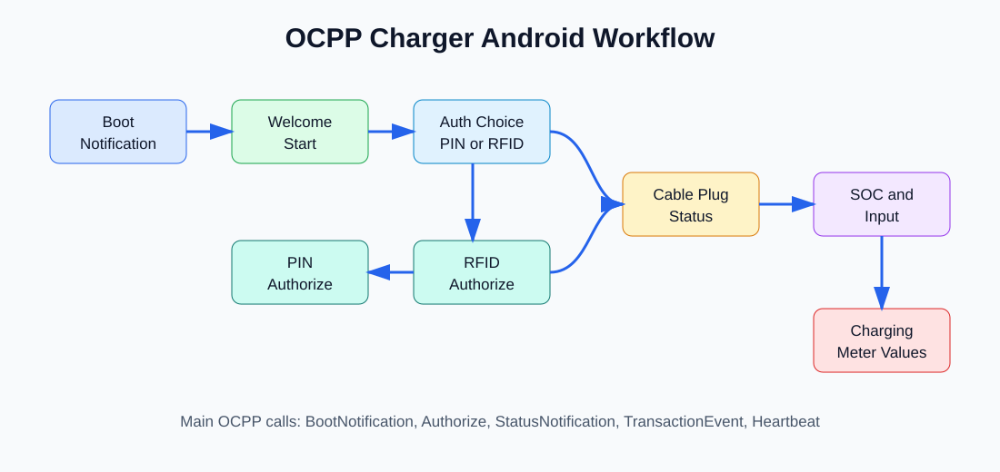

## Active Product Screens

The product branch intentionally has only two registered Activities:

| Activity | Purpose |
| --- | --- |
| `MainActivity` | Boot, WebSocket connection, and `BootNotification`. |
| `ProductChargerActivity` | Driver flow, side-by-side LED rail, RFID scanner feedback, cable wait, charging, and billing. |

## OCPP Messages

The websocket client uses OCPP-J JSON array frames:

```json
[2, "message-id", "BootNotification", {"reason":"PowerUp"}]
[3, "message-id", {"status":"Accepted"}]
[4, "message-id", "NotImplemented", "Action is not implemented", {}]
```

## Capability Level

This project has a basic OCPP 2.1 implementation. It does not implement every feature in the OCPP 2.1 specification, because the full protocol includes many advanced profiles such as smart charging, ISO 15118 certificate flows, tariff management, DER control, firmware/log transfer, monitoring streams, local authorization lists, reservations, and security events.

The app now recognizes the OCPP 2.1 schema action set through `OcppActionRegistry`. Implemented demo actions are processed normally. Known OCPP actions that are not implemented return `CALLERROR` with `NotSupported`. Unknown actions return `CALLERROR` with `NotImplemented`.

Currently wired charger-originated actions:

| Action | Sent From | Notes |
| --- | --- | --- |
| `BootNotification` | `MainActivity` via `SendRequestToCSMS` | Sent after WebSocket connection opens. |
| `Authorize` | `ProductChargerActivity` | PIN uses `KeyCode`; RFID uses `ISO14443`. |
| `Heartbeat` | `SendRequestToCSMS` | Uses schema-correct `Heartbeat` spelling. |
| `StatusNotification` | `ProductChargerActivity` | Reports connector status. |
| `TransactionEvent` | `ProductChargerActivity` | Carries authorization, cable, charging, stop, and `meterValue` state. |

CSMS-originated actions handled by the charger include:

| Action | Behavior |
| --- | --- |
| `SetNetworkProfile` | Validates and stores a new CSMS WebSocket URL. |
| `SetVariables` / `GetVariables` | Reads and updates local controller variables. |
| `SetDisplayMessage` / `SetDisplayMessages` | Stores display messages from the CSMS/CSO path. |
| `GetDisplayMessages` | Replies with status and sends matching messages through `NotifyDisplayMessages`. |
| `Reset` | Processes reset request and replies with `ResetResponse`. |
| `CostUpdated` | Updates displayed transaction cost. |

Basic fallback behavior:

| Action Type | Behavior |
| --- | --- |
| Known OCPP 2.1 action but not implemented | `CALLERROR` / `NotSupported`. |
| Unknown action | `CALLERROR` / `NotImplemented`. |
| Malformed OCPP-J frame | Decoder rejects the message. |

## RFID Flow

The product RFID flow uses the serial-Arduino style from `RHA`:

1. Prepares `/dev/ttyACM0` at `9600` baud.
2. Keeps the scanner LED blue while ready or reading.
3. Reads a UID from the serial reader off the UI thread.
4. Sends OCPP `Authorize` with:

```json
{
  "idToken": {
    "idToken": "04AABBCC",
    "type": "ISO14443"
  }
}
```

5. Blinks scanner green on `Accepted`, or red on any rejected authorization status.

## Important Files

| File | Responsibility |
| --- | --- |
| `app/src/main/java/com/example/chargergui/MyClientEndpoint.java` | WebSocket client, OCPP message routing, boot/auth responses. |
| `app/src/main/java/UseCasesOCPP/SendRequestToCSMS.java` | Builds and sends charger-originated OCPP calls. |
| `app/src/main/java/com/example/chargergui/MainActivity.java` | Connects to CSMS and waits for accepted boot. |
| `app/src/main/java/com/example/chargergui/ProductChargerActivity.java` | Product-style single-screen driver flow. |
| `app/src/main/java/com/example/chargergui/StationSignalController.java` | GPIO-backed station LEDs and RFID scanner LED feedback. |
| `app/src/main/java/Hardware/SerialRfidReader.java` | Serial RFID UID reader inspired by `RHA`. |
| `app/src/main/java/com/example/chargergui/NetworkProfileDatabase.java` | Default CSMS URL and OCPP version profile. |

## Build

Requirements:

- Java JDK configured with `JAVA_HOME`
- Android Gradle plugin dependencies
- Android SDK / build tools

Compile the app:

```bash
./gradlew :app:compileDebugJavaWithJavac
```

## Pair With CSMS

1. Build and deploy `ocppCSMS` to an app server such as GlassFish/Payara/Tomcat with WebSocket support.
2. Start the Android emulator or device.
3. Confirm charger URL:

```text
ws://<csms-host>:8080/CSMSWebsocketServer-1/CS01
```

4. Start `OCPPcharger`.
5. The app should connect, send `BootNotification`, receive `Accepted`, and move to the product charging page.
